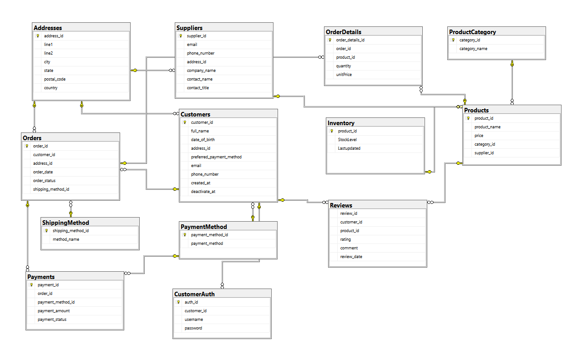

# E-CommerceSystemDB
---
Project Overview
---
E-CommerceSystemDB is an SQL-based database designed for a Global Gadgets, a digital retailer. The system manages customers, products, suppliers, orders, payments, reviews, and inventory, ensuring data consistency, referential integrity, and operational automation via T-SQL triggers, views, and stored procedures. The database was designed for a retailer who wants a scalable backend to track sales, manage inventory, and automate stock updates when orders are placed, delivered, or cancelled.

Features
---
- **Customer Management**: Stores customer profiles, billing details, and login credentials with account deactivation tracking.
- **Supplier Management**: Records supplier company and contact details for product sourcing.
- **Product & Category Management**: Organizes products by category (Premium, Standard, Budget) and enforces valid pricing.
- **Order & Payment Tracking**: Handles customer orders, order details, and payment records with status updates.
- **Inventory Control**: Automatically updates stock levels via triggers and prevents negative inventory.
- **Shipping Methods**: Normalized lookup for delivery types (Air, Sea, Land, Courier).
- **Reviews & Ratings**: Enables customers to rate and review delivered products.
- **Stored Procedures & Functions**: Automate tasks like searching products, viewing today’s orders, and updating supplier data.
- **Triggers**: Maintain stock accuracy when orders are cancelled or restocked.
- **Views**: Provide order summaries combining customer, product, and supplier data for easy reporting.

Database Schema
---
The database consists of 13 tables that form the core functionality of e-commerce system. Below is a visual representation of the database schema:


### Key Tables
- **Customers**: Stores essential customer details such as name, date of birth, billing address, and preferred payment method.
- **CustomerAuth**: Contains authentication credentials (username and password) linked to each customer for secure login.
- **Addresses**: Centralized table for storing reusable address data used by customers, suppliers, and orders.
- **Suppliers**: Stores supplier company and contact information, including address for shipping and correspondence.
- **ProductCategory**: Lookup table defining product tiers (Premium, Standard, Budget) to ensure consistent categorization.
- **Products**: Holds details of each product, including name, price, category, and supplier association.
- **Inventory**: Tracks product stock levels and last updated timestamps, automatically maintained via triggers.
- **Orders**: Manages customer orders with shipping method, order status, and order date information.
- **OrderDetails**: Links each order to its products, recording quantity and unit price for detailed tracking.
- **Payments**: Records payment transactions with method, amount, and payment status for each order.
- **PaymentMethod**: Lookup table defining valid payment types such as Credit Card, PayPal, and Bank Transfer.
- **ShippingMethod**: Lookup table for standardized delivery options like Air Freight, Sea Freight, Land Freight, and Courier.
- **Reviews**: Stores customer product ratings and comments after delivery.

### Installation and Usage
---
1. **clone the Repository**:
```sh
git clone https://github.com/Giftedman1/Database-Design-and-Implementation-for-an-E-Commerce-System.git
```
2. **Import SQL Scripts**:
- Open SQL Server Management Studio (SSMS).
- Import the SQL scripts from the sqlScripts/ folder into your database instance.
- Ensure that all tables, procedures, functions and triggers are correctly created.

### SQL Scripts
---
The repository includes SQL scripts for all database objects, including tables, views, stored procedures, functions, and triggers. These scripts are located in the sql/ folder.

### Functions and Procedures
---

#### Scalar Functions

- **SF_Get_Average_Rating_By_Product**: Returns the average customer rating for a specific product, useful for identifying high-performing or low-rated items.
- **SF_Get_Total_Sales_By_Customer**: Returns the total purchase value of all orders placed by a specific customer.

#### Table-Valued Functions

- **fn_GetProductsByCategory**: Returns a table of all products within a given category (e.g., Premium, Standard, Budget).
- **TF_Get_Orders_By_Status**: Returns a list of all orders filtered by their current status (e.g., Delivered, Pending, Cancelled).

#### Stored Procedures

- **sp_OrdersPlacedToday**: Retrieves the number of orders placed on the current date, optionally filtered by order status.
- **sp_GetOrdersByCustomer**: Show all orders placed by a specific customer.

#### Triggers

trg_PreventNegativeStock – Ensures that product stock levels never go below zero during updates or order transactions.
trg_LowStockAlert – Raises a warning when an inventory item reaches zero stock, prompting for restock.
trg_UpdateInventoryOnOrderStatus – When an order is cancelled, automatically increases stock levels for the affected products.

### Future Enchancements
---
Potential improvements for this project that could add new features and flexibility:

- **Supplier Performance Tracking**: Measure supplier reliability based on delivery times and product quality.
- Add roles/permissions system (Admin, Staff, Customer).

#### License
---
This project is licensed under the MIT License.

#### Contact
---
For any questions or suggestions, please contact qoozimjamiu21@gmail.com
